# Robot decisions and command lifetimes

**Programming team reference · OffSeason-195 · October 1, 2026**

These diagrams describe source `d22e7a2`; runtime behavior is unchanged from `5cedfe0`. Read the
[team overview](team-overview.md) first for vocabulary and the [code guide](code-guide.md) for units,
configuration and log keys. Each section links the implementation it summarizes. Diagrams deliberately
separate control flow, computed setpoints, and permission to actuate.

Rendered SVGs make the diagrams usable without Mermaid support. The expandable Mermaid blocks are
the editable source. Rectangles are operations, diamonds are decisions, and arrows name conditions.
Green indicates success, amber waiting and red rejection; text labels carry the same meaning.

**Scope:** real-camera calibration, physical acceptance and the Main/Worlds autonomous strategy choice
are still pending. This document does not turn those items into implemented or validated behavior.

## Contents

1. [Runtime ownership](#1-runtime-ownership)
2. [Mode transitions and fresh operator input](#2-mode-transitions-and-fresh-operator-input)
3. [Vision ingestion and fusion](#3-vision-ingestion-and-fusion)
4. [Disabled field-reference initialization](#4-disabled-field-reference-initialization)
5. [Target selection and shot calculation](#5-target-selection-and-shot-calculation)
6. [Supervisor arbitration and outputs](#6-supervisor-arbitration-and-outputs)
7. [Feed permission in exact priority order](#7-feed-permission-in-exact-priority-order)
8. [Trench latch and manual fallback](#8-trench-latch-and-manual-fallback)
9. [Path frames and start checks](#9-path-frames-and-start-checks)
10. [Endpoint completion and AUTO lifetime](#10-endpoint-completion-and-auto-lifetime)
11. [Intake and diagnostic cleanup](#11-intake-and-diagnostic-cleanup)
12. [Simulation boundaries](#12-simulation-boundaries)
13. [Maintaining these diagrams](#13-maintaining-these-diagrams)

## 1. Runtime ownership

[Robot](../../2026Competition/src/main/java/frc/robot/Robot.java) calls the scheduler each robot loop.
[RobotContainer](../../2026Competition/src/main/java/frc/robot/RobotContainer.java) wires subsystem
instances, controls and the auto chooser. The diagram shows responsibility, not a fixed order of
different subsystems' `periodic()` callbacks.



Editable Mermaid source

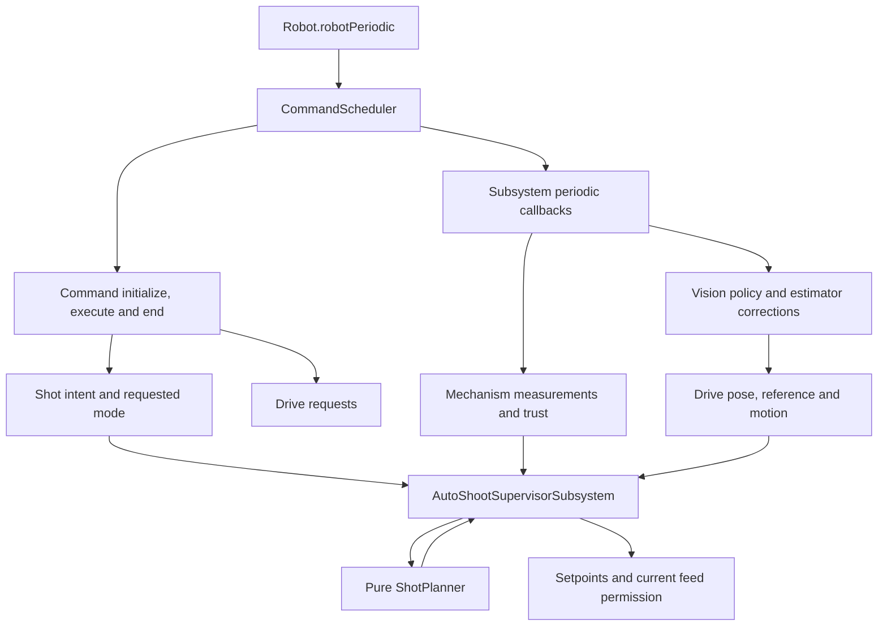
```mermaid
flowchart TD
    robot["Robot.robotPeriodic"] --> scheduler["CommandScheduler"]
    scheduler --> lifecycle["Command initialize, execute and end"]
    scheduler --> periodic["Subsystem periodic callbacks"]
    lifecycle --> intent["Shot intent and requested mode"]
    lifecycle --> drive["Drive requests"]
    periodic --> vision["Vision policy and estimator corrections"]
    periodic --> measured["Mechanism measurements and trust"]
    vision --> pose["Drive pose, reference and motion"]
    intent --> supervisor["AutoShootSupervisorSubsystem"]
    measured --> supervisor
    pose --> supervisor
    supervisor --> planner["Pure ShotPlanner"]
    planner --> supervisor
    supervisor --> outputs["Setpoints and current feed permission"]
```

A command declares all controlled subsystems as requirements. A command group owns the union of its
children's requirements for the group's entire lifetime, including waits. The supervisor compares a
mechanism's current scheduler owner with **its own current owner**; a child in the same group is not
mistaken for unrelated external control. Unrelated calibration, jog and SysId owners suppress competing
supervisor output.

This concrete interruption sequence illustrates why `end(interrupted)` matters:

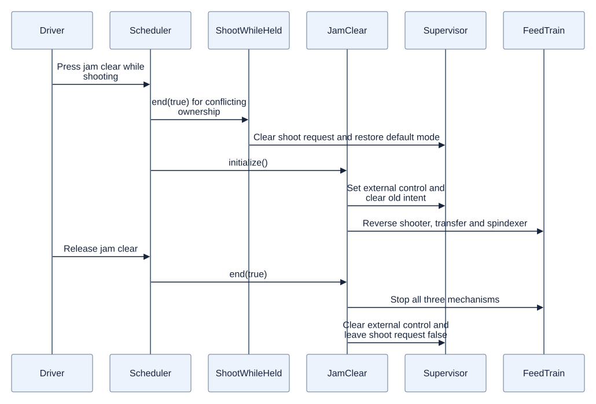

Editable Mermaid source

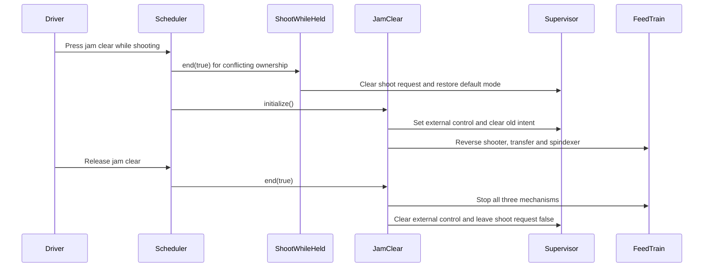
```mermaid
sequenceDiagram
    participant Driver
    participant Scheduler
    participant ShootWhileHeld
    participant JamClear
    participant Supervisor
    participant FeedTrain
    Driver->>Scheduler: Press jam clear while shooting
    Scheduler->>ShootWhileHeld: end(true) for conflicting ownership
    ShootWhileHeld->>Supervisor: Clear shoot request and restore default mode
    Scheduler->>JamClear: initialize()
    JamClear->>Supervisor: Set external control and clear old intent
    JamClear->>FeedTrain: Reverse shooter, transfer and spindexer
    Driver->>Scheduler: Release jam clear
    Scheduler->>JamClear: end(true)
    JamClear->>FeedTrain: Stop all three mechanisms
    JamClear->>Supervisor: Clear external control and leave shoot request false
```

Source: [ShootWhileHeld](../../2026Competition/src/main/java/frc/robot/commands/ShootWhileHeld.java),
[ReverseShooterTemporary](../../2026Competition/src/main/java/frc/robot/commands/ReverseShooterTemporary.java).
The driver must issue a new shoot request; a still-held interrupted `whileTrue` command is not restarted
by the end of jam clear. No command scheduling or shot-state mutation belongs on the simulation thread.

## 2. Mode transitions and fresh operator input

The binding helper calls [FreshPress.update](../../2026Competition/src/main/java/frc/robot/lib/FreshPress.java)
on every button-loop poll, including disallowed modes. Its result is a held state; `Trigger` derives edges.



Editable Mermaid source

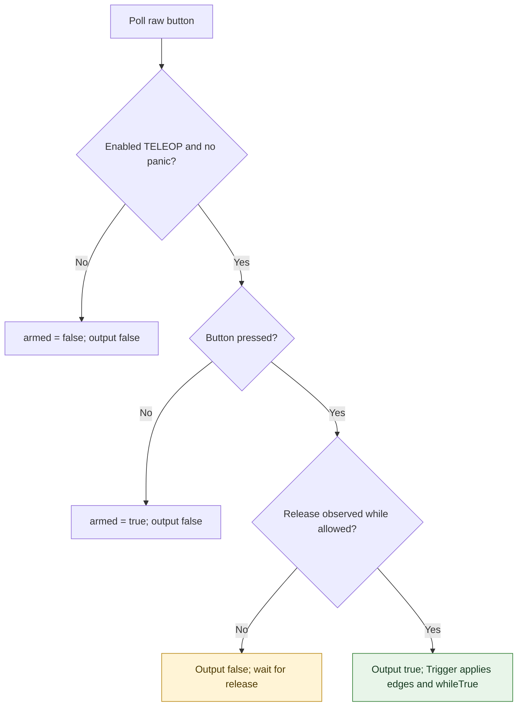
```mermaid
flowchart TD
    poll["Poll raw button"] --> allowed{"Enabled TELEOP and no panic?"}
    allowed -->|No| disarm["armed = false; output false"]
    allowed -->|Yes| pressed{"Button pressed?"}
    pressed -->|No| arm["armed = true; output false"]
    pressed -->|Yes| armed{"Release observed while allowed?"}
    armed -->|No| wait["Output false; wait for release"]
    armed -->|Yes| held["Output true; Trigger applies edges and whileTrue"]
    classDef good fill:#e8f5e9,stroke:#2e7d32,color:#163a20
    classDef wait fill:#fff4d6,stroke:#b88713,color:#4d3900
    class held good
    class wait wait
```

| Transition | Implementation consequence |
|---|---|
| Enter AUTO | Cancel existing commands, clear the old autonomous-failure latch, schedule the selected wrapper. |
| Leave AUTO / enter TELEOP | Cancel the autonomous command; child cleanup and wrapper cleanup run. |
| Leave TELEOP or TEST | Cancel all commands. Entering TEST also cancels existing commands. |
| Panic activates | Cancel commands and explicitly stop outputs, including when disabled. |
| Mode/panic gate closes on a held input | Treat as a falling edge but do not schedule a new retract/cleanup move. |
| Mode/panic gate opens | Require a release while allowed before a fresh press can trigger the action. |

`onTeleopRelease` checks permission **before scheduling** the required cleanup command. Putting
`onlyIf` around that required command would still let it acquire requirements and cancel an AUTO
owner before doing nothing. Disabled seed controls have their own disabled/stationary checks.

The default drive command returns a stop outside enabled teleop. With neutral sticks it preserves
the measured module-angle hold; an explicit permitted motion request releases that hold. Stationary
chassis aiming assist requires neutral sticks, low measured translation, known alliance and ready
competition localization. See [DriveManuallyCommand](../../2026Competition/src/main/java/frc/robot/commands/DriveManuallyCommand.java).

## 3. Vision ingestion and fusion

Source: [VisionFactory](../../2026Competition/src/main/java/frc/robot/subsystems/vision/VisionFactory.java),
[VisionIOPhotonVision](../../2026Competition/src/main/java/frc/robot/subsystems/vision/VisionIOPhotonVision.java),
[Vision](../../2026Competition/src/main/java/frc/robot/subsystems/vision/Vision.java),
[VisionPolicy](../../2026Competition/src/main/java/frc/robot/subsystems/vision/VisionPolicy.java).



Editable Mermaid source

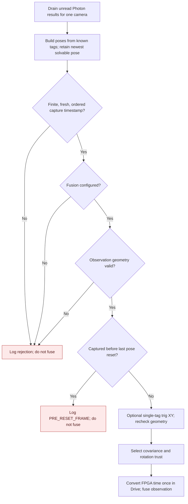
```mermaid
flowchart TD
    drain["Drain unread Photon results for one camera"] --> newest["Build poses from known tags; retain newest solvable pose"]
    newest --> time{"Finite, fresh, ordered capture timestamp?"}
    time -->|No| reject["Log rejection; do not fuse"]
    time -->|Yes| config{"Fusion configured?"}
    config -->|No| reject
    config -->|Yes| geometry{"Observation geometry valid?"}
    geometry -->|No| reject
    geometry -->|Yes| reset{"Captured before last pose reset?"}
    reset -->|Yes| suppress["Log PRE_RESET_FRAME; do not fuse"]
    reset -->|No| solve["Optional single-tag trig XY; recheck geometry"]
    solve --> weights["Select covariance and rotation trust"]
    weights --> fuse["Convert FPGA time once in Drive; fuse observation"]
    classDef stop fill:#fde9e9,stroke:#b83b3b,color:#581b1b
    class reject,suppress stop
```

The IO keeps the **newest solvable pose**, not a FIFO of all old frames and not necessarily the newest
raw frame. If the later policy rejects that pose, it does not fall back to an older candidate. Raw
MultiTag field-to-camera observations remain available for disabled calibration before fusion is enabled.

| Boundary | Contract |
|---|---|
| Pi solve → robot pose | Compose field-to-camera with the inverse of measured robot-to-camera. Single-tag reconstruction also uses the selected tag layout. |
| Capture time | FPGA seconds; reject duplicates/out-of-order, old, future or pre-reset captures. Receiving a frame is not evidence of fresh capture. |
| Default solve / covariance | PnP / isotropic. Trig XY and anisotropic weighting are explicit experiments, not automatic fallback modes. Missing trig history falls back to the original PnP pose; a reconstructed trig pose failing geometry is rejected. |
| Heading | Single-tag yaw is never fused. Enabled vision rotation fusion is disabled; gyro owns enabled heading. Disabled eligible MultiTag can contribute heading and seed reference. |
| Timestamp conversion | Only `DriveSubsystem.addVisionMeasurement` changes FPGA time to CTRE time. |
| Configuration failure | No accepted vision IO; preserve manual drivetrain operation. Do not insert synthetic real-camera calibration. |

Field pose remains in the **blue-origin frame on both alliances**. The selected profile must separately
permit competition targets and paths; a valid custom survey profile does not grant that permission.

## 4. Disabled field-reference initialization

Source: [LocalizationBootstrap](../../2026Competition/src/main/java/frc/robot/subsystems/vision/LocalizationBootstrap.java)
and [DriveSubsystem](../../2026Competition/src/main/java/frc/robot/subsystems/DriveSubsystem.java).
Only caller-vetted, calibrated MultiTag samples enter this decision tree.



Editable Mermaid source

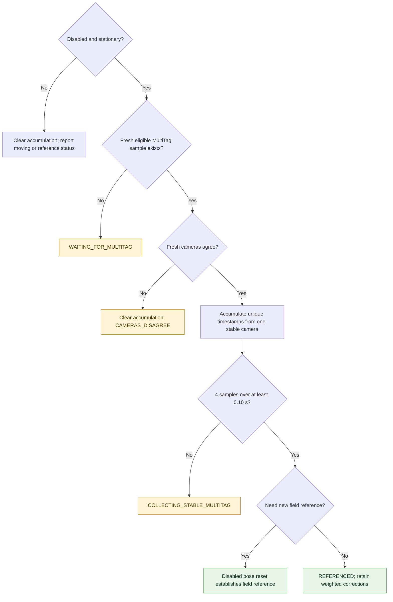
```mermaid
flowchart TD
    gate{"Disabled and stationary?"}
    gate -->|No| clear["Clear accumulation; report moving or reference status"]
    gate -->|Yes| fresh{"Fresh eligible MultiTag sample exists?"}
    fresh -->|No| waiting["WAITING_FOR_MULTITAG"]
    fresh -->|Yes| agree{"Fresh cameras agree?"}
    agree -->|No| disagree["Clear accumulation; CAMERAS_DISAGREE"]
    agree -->|Yes| collect["Accumulate unique timestamps from one stable camera"]
    collect --> stable{"4 samples over at least 0.10 s?"}
    stable -->|No| more["COLLECTING_STABLE_MULTITAG"]
    stable -->|Yes| reset{"Need new field reference?"}
    reset -->|Yes| seed["Disabled pose reset establishes field reference"]
    reset -->|No| keep["REFERENCED; retain weighted corrections"]
    classDef good fill:#e8f5e9,stroke:#2e7d32,color:#163a20
    classDef wait fill:#fff4d6,stroke:#b88713,color:#4d3900
    class seed,keep good
    class waiting,disagree,more wait
```

Current settings: sample age at most 0.25 s; stability/agreement within 0.10 m and 3 degrees. A camera
change, sample gap or pose spread restarts accumulation. Existing reference is reanchored only when
translation differs by more than 0.25 m, heading by more than 3 degrees, or the estimate is invalid.
One camera can qualify; a fresh disagreeing camera vetoes it.

Drive's stationary check requires a recent drive state, translation below 0.02 m/s and gyro rotation
below 1 degree/s. These are software criteria, not independent measurements of the physical robot.

| Predicate / action | Meaning |
|---|---|
| `hasFieldReference()` | Explicit reference established plus healthy gyro yaw with latency below 0.1 s. |
| `hasRecentMeasurement()` | Recent accepted capture strictly after the last reset. |
| `isLocalizationReady()` | Both reference and recent vision; profile/alliance checks are added by callers. |
| Plain `resetPose` / gyro reset | Revoke field trust; pose reset also clears history and records reset time. |
| Qualified disabled vision reset / known physical-pose reset | Deliberately reestablish reference. A subsequent fresh frame is still needed for general localization readiness. |
| Driver-forward reset / alliance perspective | Change joystick interpretation only. |

Do not add a fixed early-AUTO quarantine. Capture-time rejection handles old images without withholding
new ones. Log connection, first frame, first pose and first fusion separately when diagnosing startup.

## 5. Target selection and shot calculation

Source: [FieldTargeting](../../2026Competition/src/main/java/frc/robot/lib/FieldTargeting.java),
[ShotPlanner](../../2026Competition/src/main/java/frc/robot/lib/ShotPlanner.java),
[MovingAimModel](../../2026Competition/src/main/java/frc/robot/lib/MovingAimModel.java),
[AimGeometry](../../2026Competition/src/main/java/frc/robot/lib/AimGeometry.java).



Editable Mermaid source

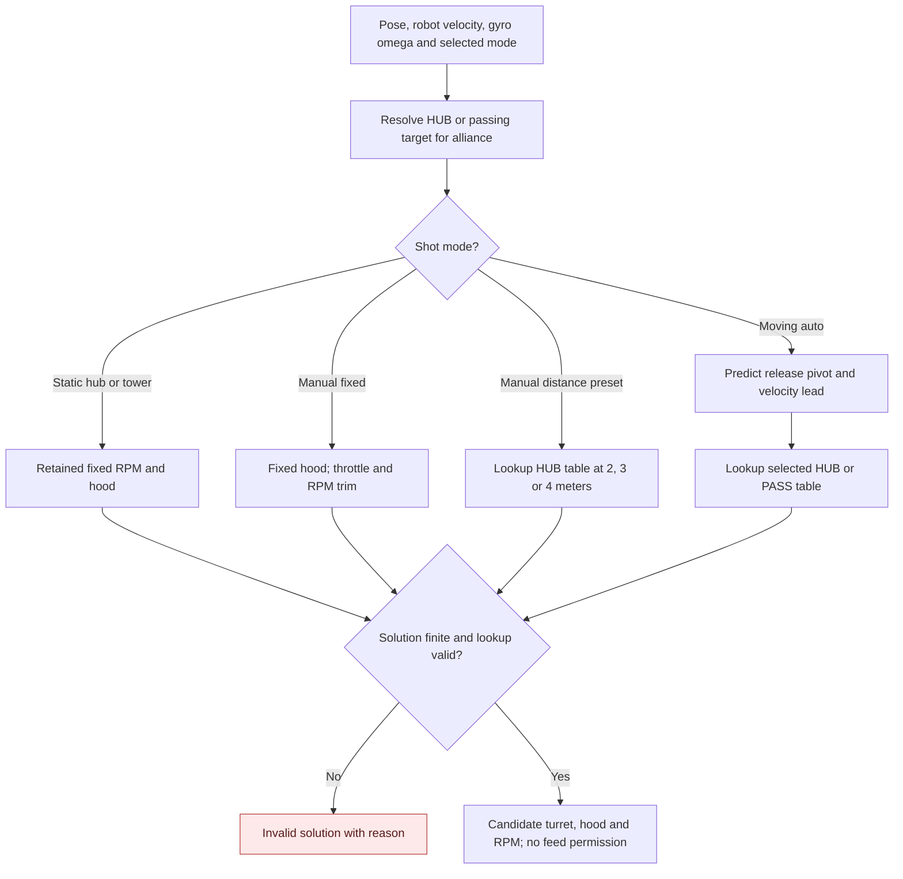
```mermaid
flowchart TD
    inputs["Pose, robot velocity, gyro omega and selected mode"] --> target["Resolve HUB or passing target for alliance"]
    target --> mode{"Shot mode?"}
    mode -->|Static hub or tower| fixed["Retained fixed RPM and hood"]
    mode -->|Manual fixed| throttle["Fixed hood; throttle and RPM trim"]
    mode -->|Manual distance preset| preset["Lookup HUB table at 2, 3 or 4 meters"]
    mode -->|Moving auto| lead["Predict release pivot and velocity lead"]
    lead --> table["Lookup selected HUB or PASS table"]
    fixed --> valid{"Solution finite and lookup valid?"}
    throttle --> valid
    preset --> valid
    table --> valid
    valid -->|No| invalid["Invalid solution with reason"]
    valid -->|Yes| candidate["Candidate turret, hood and RPM; no feed permission"]
    classDef stop fill:#fde9e9,stroke:#b83b3b,color:#581b1b
    class invalid stop
```

Non-moving modes select HUB. Moving mode chooses HUB versus a neutral passing target using alliance-relative
position and hysteresis; it selects the lower/upper target by field half. The retained X boundary is
4.664 m with 0.15 m hysteresis. This target-selection boundary is distinct from the hub-zone feed boundary.

The hub and passing tables are separate. The shipped passing table is empty, so passing returns
`NO_MEASURED_PASS_SOLUTION`. A malformed table is rejected as a whole. Fixed modes retain their existing
settings; they are not newly calibrated by this refactor. `Solution.valid` establishes usable computation
and lookup, not field permission, turret reachability or mechanism readiness.

### Why moving aim includes the turret offset



Editable Mermaid source

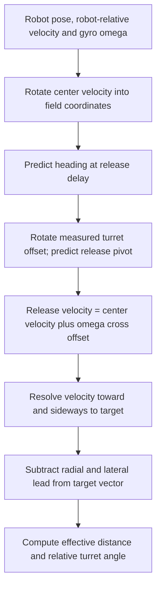
```mermaid
flowchart TD
    observation["Robot pose, robot-relative velocity and gyro omega"] --> field["Rotate center velocity into field coordinates"]
    field --> heading["Predict heading at release delay"]
    heading --> pivot["Rotate measured turret offset; predict release pivot"]
    pivot --> velocity["Release velocity = center velocity plus omega cross offset"]
    velocity --> components["Resolve velocity toward and sideways to target"]
    components --> compensate["Subtract radial and lateral lead from target vector"]
    compensate --> result["Compute effective distance and relative turret angle"]
```

Robot axes are +X forward, +Y left. The retained negative turret X is behind the robot center and
negative Y is to its right. Rotate that vector by predicted release heading before adding it to field
position. Its rotation-induced velocity is `(-omega * offsetY, omega * offsetX)` in field axes.

The release delay is 0.12 s. Measured flight time, when available at the lookup distance, supplies both
lead times. Otherwise the current labeled fallback uses 0.30 s radial and 0.45 s lateral empirical lead.
The flight-time table is currently empty. This constant-velocity approximation does not model acceleration,
drag or slip. Read-only shot diagnostics call the same planner without changing control state.

## 6. Supervisor arbitration and outputs

Source: [AutoShootSupervisorSubsystem.periodic](../../2026Competition/src/main/java/frc/robot/subsystems/AutoShootSupervisorSubsystem.java).
Intent/trench observation and default `FeedAllowed=false` logging occur first; a disabled supervisor
feature returns without normal control work. For the enabled feature, this is the branch structure:



Editable Mermaid source

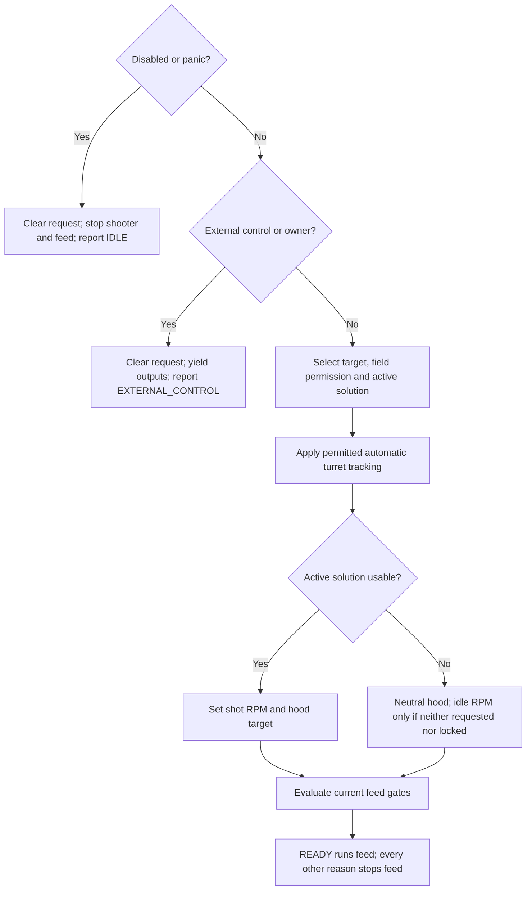
```mermaid
flowchart TD
    mode{"Disabled or panic?"}
    mode -->|Yes| stop["Clear request; stop shooter and feed; report IDLE"]
    mode -->|No| owner{"External control or owner?"}
    owner -->|Yes| yield["Clear request; yield outputs; report EXTERNAL_CONTROL"]
    owner -->|No| plan["Select target, field permission and active solution"]
    plan --> aim["Apply permitted automatic turret tracking"]
    aim --> usable{"Active solution usable?"}
    usable -->|Yes| setpoints["Set shot RPM and hood target"]
    usable -->|No| neutral["Neutral hood; idle RPM only if neither requested nor locked"]
    setpoints --> readiness["Evaluate current feed gates"]
    neutral --> readiness
    readiness --> output["READY runs feed; every other reason stops feed"]
```

An external owner is responsible for stopping its outputs in `end()`. The supervisor does not write
competing outputs in that branch. It may still request a neutral hood for a trench lock if the hood
is unowned or owned by the supervisor's same scheduler command.

`active = requested && !trenchLocked`. A usable active solution can spin up shooter/hood before all
feed checks pass. With no request and no trench lock, enabled idle behavior requests 2,200 RPM;
otherwise an unusable solution stops the shooter. Turret tracking can also remain active while idle
when `ALWAYS_AIM` and localization permit it. Clamping the commanded turret target does not make the
original desired angle reachable: feed readiness uses the unclamped demand, or measured angle in
manual-aim mode.

## 7. Feed permission in exact priority order

Source: [ShotReadiness.evaluate](../../2026Competition/src/main/java/frc/robot/lib/ShotReadiness.java).
The first failing gate is the logged `AutoShoot/FeedReason`. The two diagrams are one ordered decision
chain, split for readability. The complete chain runs again while `FIRING`.



Editable Mermaid source

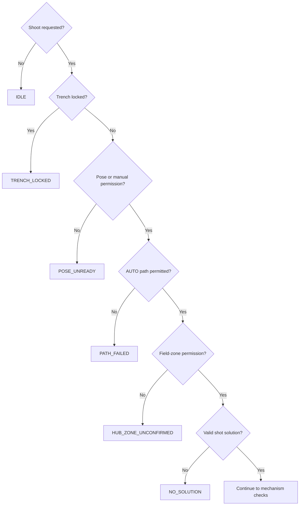
```mermaid
flowchart TD
    requested{"Shoot requested?"} -->|No| idle["IDLE"]
    requested -->|Yes| trench{"Trench locked?"}
    trench -->|Yes| locked["TRENCH_LOCKED"]
    trench -->|No| pose{"Pose or manual permission?"}
    pose -->|No| noPose["POSE_UNREADY"]
    pose -->|Yes| path{"AUTO path permitted?"}
    path -->|No| noPath["PATH_FAILED"]
    path -->|Yes| zone{"Field-zone permission?"}
    zone -->|No| noZone["HUB_ZONE_UNCONFIRMED"]
    zone -->|Yes| solution{"Valid shot solution?"}
    solution -->|No| noSolution["NO_SOLUTION"]
    solution -->|Yes| next["Continue to mechanism checks"]
```



Editable Mermaid source

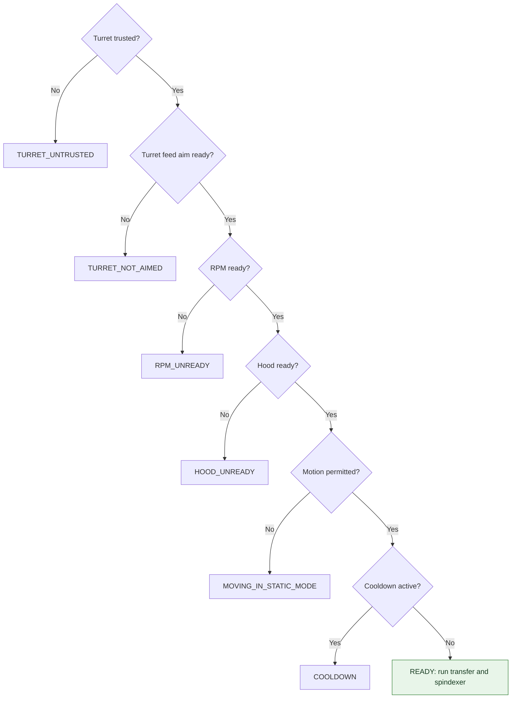
```mermaid
flowchart TD
    trusted{"Turret trusted?"} -->|No| noTrust["TURRET_UNTRUSTED"]
    trusted -->|Yes| aimed{"Turret feed aim ready?"}
    aimed -->|No| noAim["TURRET_NOT_AIMED"]
    aimed -->|Yes| rpm{"RPM ready?"}
    rpm -->|No| noRpm["RPM_UNREADY"]
    rpm -->|Yes| hood{"Hood ready?"}
    hood -->|No| noHood["HOOD_UNREADY"]
    hood -->|Yes| motion{"Motion permitted?"}
    motion -->|No| noMotion["MOVING_IN_STATIC_MODE"]
    motion -->|Yes| cooldown{"Cooldown active?"}
    cooldown -->|Yes| recover["COOLDOWN"]
    cooldown -->|No| ready["READY: run transfer and spindexer"]
    classDef good fill:#e8f5e9,stroke:#2e7d32,color:#163a20
    class ready good
```

| Detail | Current behavior |
|---|---|
| Turret windows | Command perimeter limits ±110 degrees; automatic aim clamp ±105; feed comfort window ±95. Automatic feed requires actual aim within tolerance of the original desired angle. |
| Manual aim | Uses measured turret angle for the feed window and skips automatic angular alignment, but still requires trusted turret position. |
| Static motion | Each absolute robot-frame X/Y speed must be below 0.15 m/s and gyro rate below 12 degrees/s. Moving mode bypasses only this static-motion gate. |
| Cooldown | Throat occupied → empty while FIRING sets a 0.015 s recovery delay. This never bypasses other checks. |
| Controller trust | Hood readiness includes its subsystem's trust/target checks; shooter readiness uses current measurements and target history. An old ready result cannot force feed. |

Mechanism reference is separate from field reference. The turret's 11:1 pinion absolute reading repeats
every 32.73 degrees of turret travel; boot/reseed requires physical stow within the known ±16.36-degree
branch. An accepted wrapped reading cannot prove that branch identity. A later motor reset revokes
integrated-position trust. Retain continuous measured angle and the negative motor-angle sign instead
of clamping measurements to disguise overshoot. See
[TurretSubsystem](../../2026Competition/src/main/java/frc/robot/subsystems/TurretSubsystem.java),
[HoodSubsystem](../../2026Competition/src/main/java/frc/robot/subsystems/HoodSubsystem.java) and
[ShooterSubsystem](../../2026Competition/src/main/java/frc/robot/subsystems/ShooterSubsystem.java)
for measurement, trust and output-mode contracts.

`VolleyState` summarizes the current result; it is not a one-way state machine that guarantees a shot:

| Feed result | Volley state |
|---|---|
| `READY` | `FIRING` |
| `IDLE` | `IDLE` |
| `NO_SOLUTION`, `POSE_UNREADY`, `PATH_FAILED`, `HUB_ZONE_UNCONFIRMED` | `NO_SOLUTION` |
| `RPM_UNREADY`, `HOOD_UNREADY`, `COOLDOWN` | `RECOVERING` |
| Other feed inhibits | `ARMING` |
| Earlier ownership branch | `EXTERNAL_CONTROL` |

## 8. Trench latch and manual fallback

Source: [ShotIntent](../../2026Competition/src/main/java/frc/robot/lib/ShotIntent.java),
[FieldTargeting](../../2026Competition/src/main/java/frc/robot/lib/FieldTargeting.java),
[FieldRules](../../2026Competition/src/main/java/frc/robot/lib/FieldRules.java).



Editable Mermaid source

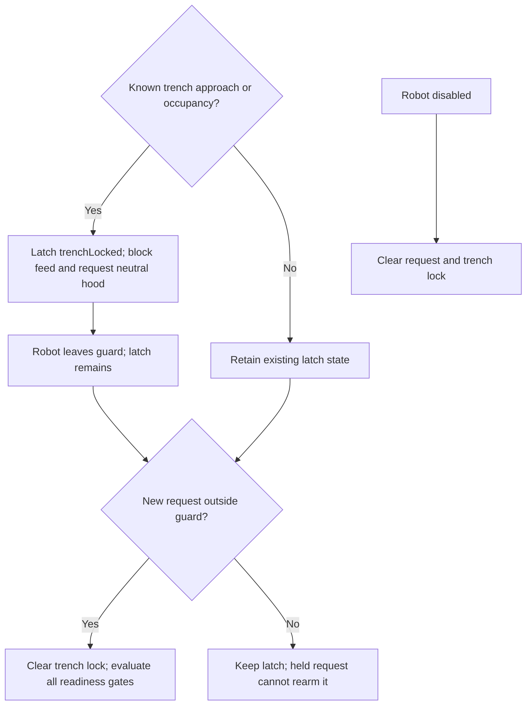
```mermaid
flowchart TD
    observe{"Known trench approach or occupancy?"}
    observe -->|Yes| lock["Latch trenchLocked; block feed and request neutral hood"]
    observe -->|No| retained["Retain existing latch state"]
    lock --> exit["Robot leaves guard; latch remains"]
    exit --> fresh{"New request outside guard?"}
    retained --> fresh
    fresh -->|Yes| clear["Clear trench lock; evaluate all readiness gates"]
    fresh -->|No| keep["Keep latch; held request cannot rearm it"]
    disabled["Robot disabled"] --> reset["Clear request and trench lock"]
```

Trench entry latches an inhibit; it does **not** itself set `requested=false`. Repeated true requests
cannot clear the latch. The owner must clear and reissue intent outside the guard. An autonomous
`ShootWhileHeld` that stays scheduled through a trench therefore cannot resume merely by leaving it.
External-control entry and exit both clear the requested flag.

`inKnownTrench` requires the competition profile and a valid drive reference, then tests a 0.35 s
translation segment against all four nominal trench structures expanded by 0.45 m. It does not
require recent vision separately. The padding/lookahead are provisional settings; the code has no
measured swept robot envelope or verified hood-lowering model. When field reference is unavailable,
the software cannot identify a new trench encounter; an existing latch still inhibits feed.

The supervisor calculates pose and manual permissions before the readiness evaluator:

| Permission | Exact construction |
|---|---|
| `poseReady` | Known alliance AND competition profile AND `vision.isLocalizationReady()`. |
| `manualAim` | Shot mode is not `MOVING_AUTO` AND hub tracking is disabled by the button box. |
| `manualZoneConfirmation` | `manualAim && !poseReady`; shown as `AutoShoot/ManualZoneConfirmationRequired`. |
| `fieldZoneAllowed` | Non-HUB target OR manual-zone exception OR confirmed pose with `hubZoneConfirmed`. |
| Readiness pose input | `poseReady || manualAim`. |

For a known HUB pose, both current and release-predicted alliance-relative X must be within
`158.6 in - 0.10 m`, with finite in-field pose and valid timing. Release prediction uses field-relative
X velocity and the 0.12 s release delay. This conservative center check is not measured bumper geometry.
The manual exception is a mentor-approved driver responsibility, not an automatic confirmation.
These are software implementations of position guards; the [rules audit](second-pass-audit.md#rules-and-position-gates)
records the official manual references and physical limits.

## 9. Path frames and start checks

Source: [PrecisionPathCommands](../../2026Competition/src/main/java/frc/robot/commands/PrecisionPathCommands.java)
and [RobotContainer.followCompetitionPath](../../2026Competition/src/main/java/frc/robot/RobotContainer.java).
Path loading and alliance resolution occur when the deferred command is scheduled.



Editable Mermaid source

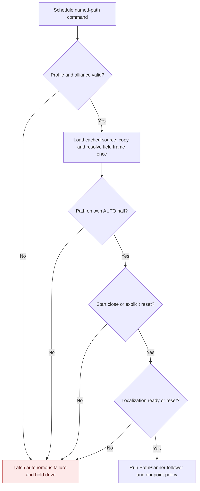
```mermaid
flowchart TD
    deferred["Schedule named-path command"] --> profile{"Profile and alliance valid?"}
    profile -->|No| failed["Latch autonomous failure and hold drive"]
    profile -->|Yes| copy["Load cached source; copy and resolve field frame once"]
    copy --> half{"Path on own AUTO half?"}
    half -->|No| failed
    half -->|Yes| start{"Start close or explicit reset?"}
    start -->|No| failed
    start -->|Yes| reference{"Localization ready or reset?"}
    reference -->|No| failed
    reference -->|Yes| follow["Run PathPlanner follower and endpoint policy"]
    classDef stop fill:#fde9e9,stroke:#b83b3b,color:#581b1b
    class failed stop
```

Load/geometry exceptions also go to `failedHold`. Normal competition callers use `resetToStart=false`;
the explicit reset API is reserved for independently known physical placement. It must never hide a
bad estimate. A named path starting too far away is rejected rather than silently skipped.

| Field frame | Transformation on the copy |
|---|---|
| `ALLIANCE` | Flip for RED only if the source did not set `preventFlipping`. |
| `FORCE_RED` | Explicitly flip, regardless of current alliance/source flag. |
| `ABSOLUTE` | Preserve coordinates. |
| Every resolved copy | Set `preventFlipping=true`, so AutoBuilder cannot flip it again. Preserve name/events. |

Alliance-specific routines separately require their expected alliance. The field origin itself never
changes. The opening approach resolves the same first-path start and requires lateral separation
≤0.25 m, total separation ≤3 m and a start on the alliance-zone side. This is a straight corridor
approach, not obstacle-aware pathfinding. The path-center half-field test does not simulate bumper
clearance or enforce a live collision boundary.

During AUTO, a motion request without field reference latches failure and stops. Panic or an already
latched failure also blocks requests. Loss of recent vision alone blocks subsequent start/finish
qualification; it is not a continuous camera-freshness abort inside the coarse follower.

## 10. Endpoint completion and AUTO lifetime



Editable Mermaid source

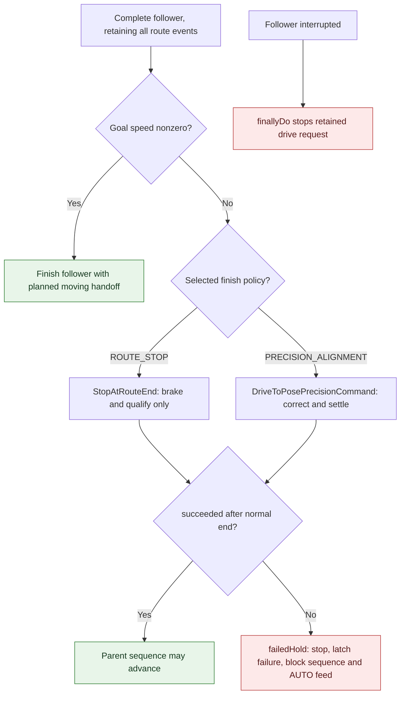
```mermaid
flowchart TD
    coarse["Complete follower, retaining all route events"] --> speed{"Goal speed nonzero?"}
    speed -->|Yes| handoff["Finish follower with planned moving handoff"]
    speed -->|No| policy{"Selected finish policy?"}
    policy -->|ROUTE_STOP| route["StopAtRouteEnd: brake and qualify only"]
    policy -->|PRECISION_ALIGNMENT| precise["DriveToPosePrecisionCommand: correct and settle"]
    route --> success{"succeeded after normal end?"}
    precise --> success
    success -->|Yes| advance["Parent sequence may advance"]
    success -->|No| hold["failedHold: stop, latch failure, block sequence and AUTO feed"]
    interrupted["Follower interrupted"] --> stop["finallyDo stops retained drive request"]
    classDef good fill:#e8f5e9,stroke:#2e7d32,color:#163a20
    classDef stop fill:#fde9e9,stroke:#b83b3b,color:#581b1b
    class handoff,advance good
    class hold,stop stop
```

| Policy | Current behavior and settings |
|---|---|
| `ROUTE_STOP` | Competition named paths and opening approaches. No corrective motion. Position error ≤0.20 m, heading ≤5 degrees, every module ≤0.15 m/s and gyro ≤8 degrees/s, with ready localization, continuously for 0.06 s. Maximum 0.50 s. |
| `PRECISION_ALIGNMENT` | Explicit precision calls/tests. Corrective controller plus measured-motion settle/hold and escape/requalification logic. Default pose tolerance 0.04 m / 1.5 degrees; 4 s safety timeout. See source for all motion and hysteresis criteria. |
| Failed finish | Timeout is not success. `failedHold` never finishes normally; deadline/mode cancellation releases it. |
| Nonzero goal | No endpoint qualification; join position, heading and velocity direction must agree in the authored route. |

Source: [StopAtRouteEnd](../../2026Competition/src/main/java/frc/robot/commands/StopAtRouteEnd.java),
[DriveToPosePrecisionCommand](../../2026Competition/src/main/java/frc/robot/commands/DriveToPosePrecisionCommand.java),
[PrecisionConstants](../../2026Competition/src/main/java/frc/robot/config/PrecisionConstants.java).
All tolerances remain subject to physical acceptance. The return from `isFinished()` alone does not
distinguish timeout from success; callers inspect `succeeded()` after normal command end.

### The enclosing routine owns the clock



Editable Mermaid source

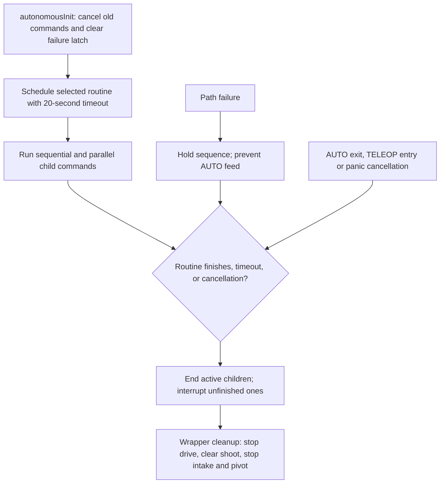
```mermaid
flowchart TD
    init["autonomousInit: cancel old commands and clear failure latch"] --> selected["Schedule selected routine with 20-second timeout"]
    selected --> group["Run sequential and parallel child commands"]
    group --> outcome{"Routine finishes, timeout, or cancellation?"}
    outcome --> children["End active children; interrupt unfinished ones"]
    children --> wrapper["Wrapper cleanup: stop drive, clear shoot, stop intake and pivot"]
    failure["Path failure"] --> stalled["Hold sequence; prevent AUTO feed"]
    stalled --> outcome
    exit["AUTO exit, TELEOP entry or panic cancellation"] --> outcome
```

| Composition | Completion and interruption consequence |
|---|---|
| Sequential group | A successful child can advance; a never-ending failure hold cannot. |
| `raceWith` | First finisher ends the group; other active children get `end(true)`. A path/intake race stops rollers when the path ends. |
| `alongWith` | Waits for all children. Shooting and intake cycling both continue until their enclosing race/deadline interrupts them. |
| `withTimeout(20)` | Interrupts incomplete selected AUTO. It limits runtime without guaranteeing mission completion. |

Current route shape, before the still-pending strategy change:

| Routine | Ordered phases | Nominal named-path time |
|---|---|---:|
| Main Blue/Red | Initial deploy → opening approach → first collection → moving shot toward trench → later collection → final 5 s shot | 20.829 s |
| Worlds Blue | 1 s delay → deploy/approach → first sweep → 3.75 s shot → up to 1.5 s deploy → depot/left-line paths → 2 s shot | 13.282 s |
| Worlds Red | 3 s delay → deploy/approach → first sweep → 3.75 s shot → up to 1.5 s deploy → depot path → 2 s shot | 11.652 s |

These full sequences exceed the budget after waits, shots, deployment, approach and brake checks are
included. They have **zero strict corrective precision finishes**; current ordinary brake-check counts,
including the approach, are Main 8 / Worlds Blue 6 / Worlds Red 5. The valid Main 0.5 m/s handoff remains.
The [route audit](second-pass-audit.md#auto-stop-and-trajectory-findings) gives provenance and constraints.
There is currently no remaining-time branch to select or skip a second pickup. Default selection is
Do nothing. Document a new strategy only after the mentor selects it and code/tests are updated.

## 11. Intake and diagnostic cleanup

Source: [DeployIntakeSequence](../../2026Competition/src/main/java/frc/robot/commands/DeployIntakeSequence.java),
[RetractIntakeSequence](../../2026Competition/src/main/java/frc/robot/commands/RetractIntakeSequence.java),
[DeployAndRunIntakeWhileHeld](../../2026Competition/src/main/java/frc/robot/commands/DeployAndRunIntakeWhileHeld.java),
[InitialAutoDeployWhileHeld](../../2026Competition/src/main/java/frc/robot/commands/InitialAutoDeployWhileHeld.java).



Editable Mermaid source

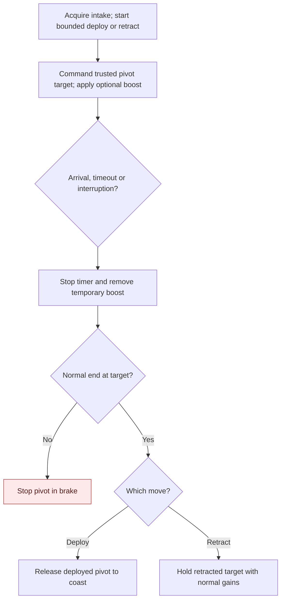
```mermaid
flowchart TD
    init["Acquire intake; start bounded deploy or retract"] --> move["Command trusted pivot target; apply optional boost"]
    move --> done{"Arrival, timeout or interruption?"}
    done --> cleanup["Stop timer and remove temporary boost"]
    cleanup --> success{"Normal end at target?"}
    success -->|No| brake["Stop pivot in brake"]
    success -->|Yes| target{"Which move?"}
    target -->|Deploy| coast["Release deployed pivot to coast"]
    target -->|Retract| hold["Hold retracted target with normal gains"]
    classDef stop fill:#fde9e9,stroke:#b83b3b,color:#581b1b
    class brake stop
```

This is the general cleanup contract, not a line-by-line ordering of every subsystem call. Both bounded
position commands use a 5 s timeout. Disabling gain boost also reissues an active closed-loop target in
the normal hardware slot; clearing a Java boolean alone would leave the controller boosted.

| Special action | Additional lifetime contract |
|---|---|
| LT deploy/run while held | Rollers run; reaching deploy coasts pivot. After 5 s without arrival, brake pivot while rollers remain requested. Release/interruption stops rollers; interruption brakes pivot. |
| LT falling edge | Only in allowed teleop: either keep deployed and stop rollers, or schedule retract according to the retained setting. |
| Initial AUTO deploy | Rollers stopped; current boost ≤0.75 s; command ends on target or 3 s timeout. Every end restores current limits and brakes pivot. |
| Retract during teleop | Retains existing roller action during retract, then stops rollers at end. |
| Intake homing | Require fresh current evidence from both motors, minimum elapsed time and debounced stall. Seed only after confirmed stall and normal end. Timeout/interruption never establishes zero. |

Source for homing: [IntakeRezeroFromRetractedHardStop](../../2026Competition/src/main/java/frc/robot/commands/IntakeRezeroFromRetractedHardStop.java),
[HardStopHoming](../../2026Competition/src/main/java/frc/robot/lib/HardStopHoming.java).
A current stall is only a proxy; an obstruction can also stall the mechanism, so the operator needs an
unobstructed homing setup. Turret/hood/intake trust and reset checks remain in their owning subsystems.
Climb stays disabled until physical home, limits and follower direction are validated.

### SysId is checked when scheduled and while running



Editable Mermaid source

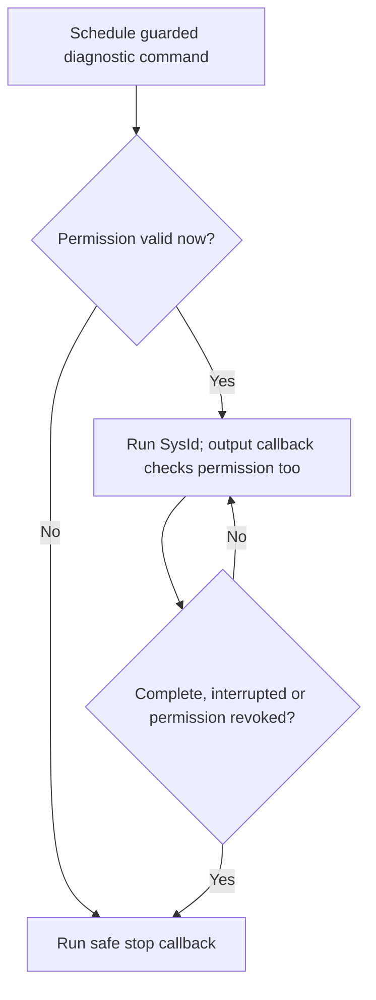
```mermaid
flowchart TD
    schedule["Schedule guarded diagnostic command"] --> allowed{"Permission valid now?"}
    allowed -->|No| stop["Run safe stop callback"]
    allowed -->|Yes| routine["Run SysId; output callback checks permission too"]
    routine --> exit{"Complete, interrupted or permission revoked?"}
    exit -->|No| routine
    exit -->|Yes| stop
```

Source: [GuardedSysId](../../2026Competition/src/main/java/frc/robot/commands/GuardedSysId.java).
The wrapper still owns its requirements even when denied; it belongs on explicit diagnostic controls.
Its stop callback must be safe when the routine never initialized. Constructing a command while disabled
does not permanently decide whether it may run later in TEST.

## 12. Simulation boundaries

Source: [VisionFactory](../../2026Competition/src/main/java/frc/robot/subsystems/vision/VisionFactory.java),
[VisionIOPhotonVisionSim](../../2026Competition/src/main/java/frc/robot/subsystems/vision/VisionIOPhotonVisionSim.java),
[RotaryMotorSim](../../2026Competition/src/main/java/frc/robot/simulation/RotaryMotorSim.java),
[DriveSubsystem](../../2026Competition/src/main/java/frc/robot/subsystems/DriveSubsystem.java),
[Robot.simulationPeriodic](../../2026Competition/src/main/java/frc/robot/Robot.java).



Editable Mermaid source

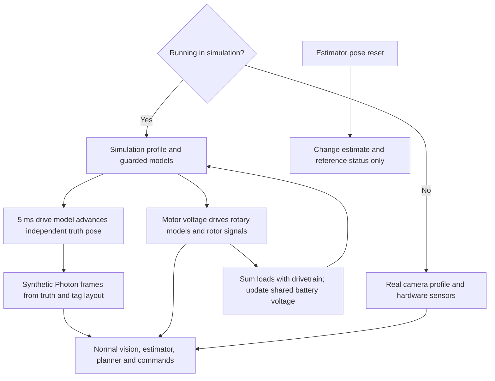
```mermaid
flowchart TD
    environment{"Running in simulation?"}
    environment -->|No| real["Real camera profile and hardware sensors"]
    environment -->|Yes| sim["Simulation profile and guarded models"]
    sim --> motors["Motor voltage drives rotary models and rotor signals"]
    sim --> truth["5 ms drive model advances independent truth pose"]
    truth --> camera["Synthetic Photon frames from truth and tag layout"]
    camera --> normal["Normal vision, estimator, planner and commands"]
    motors --> normal
    real --> normal
    motors --> battery["Sum loads with drivetrain; update shared battery voltage"]
    battery --> sim
    reset["Estimator pose reset"] --> estimate["Change estimate and reference status only"]
```

| Boundary | Why it matters |
|---|---|
| Real startup | Reject a simulation camera profile. Construct models and write synthetic sensor state only in simulation. |
| Rotary units | Model arguments are inertia before gearing. Reduction is motor turns per mechanism turn; return rotor position/RPS to CTRE with that reduction applied. |
| Load | Include paired motors/follower signals and nonnegative simulated battery load; sum mechanism and drivetrain currents. Inertias remain provisional. |
| Truth versus estimate | `placeSimulationRobot` changes simulated placement. `resetPose` changes only the estimate; camera truth is not derived from that estimate. |
| Separate drive thread | The 5 ms notifier and placement use the same synchronized boundary; truth snapshots are volatile. Normal command/state decisions remain on the scheduler thread. |
| Camera world | Each simulated camera has its own managed world/lifecycle; no shared static world accumulates stale layouts/cameras. |
| Shutdown | Close cameras and simulation worlds, and close the drive notifier before the drivetrain. |

The models exercise sensor/control integration. They do not provide validated gravity, hard-stop
contact, collisions, fuel transport or ballistic accuracy. Vision IO logging is available; full
deterministic replay of all direct CTRE mechanisms is not implemented.

## 13. Maintaining these diagrams

Edit Mermaid blocks in these two Markdown files, then regenerate their adjacent SVGs using
[render_diagrams.mjs](../../tools/render_diagrams.mjs). The renderer checks Mermaid parsing and diagram
geometry; it does not prove the software logic. Follow its usage comment for the required local tools.
Keep rendered images and source definitions together in the same commit.

| If this behavior changes | Update these sections and verify the corresponding behavior |
|---|---|
| Control gating or requirement ownership | Sections 1–2; fresh-press, scheduler and complete robot smoke checks. |
| Vision/time/reference policy | Sections 3–4; vision-policy, bootstrap and Photon integration checks. |
| Shot modes, targeting or feed conditions | Sections 5–8; geometry, planner, intent/readiness and field/trench checks. |
| Paths, frame transforms or endpoint policy | Sections 9–10; route audit, precision/route-stop and interruption checks. |
| Mechanism cleanup or SysId | Section 11; homing/permission checks and hardware-request cleanup in smoke test. |
| Model wiring or lifecycle | Section 12; rotary-model, Photon simulation and complete robot startup/shutdown checks. |

The [test plan](testing.md) describes commands and physical acceptance. A diagram-only edit needs
render/link/source review; it does not require rerunning robot behavior tests when runtime code is
unchanged. Keep tests, docs and evidence outside `2026Competition/src/`. The current line-change report
remains pinned to its Java source revision; these Markdown/SVG additions do not change production Java.
