# How our robot software works

**For the whole team · OffSeason-195 · October 1, 2026**

The robot continually answers three questions: **Where am I? What action is requested? Is that action
ready to run?** Cameras and sensors answer the first question, the driver or autonomous routine answers
the second, and the control software checks the third before moving fuel or mechanisms.

This guide describes source revision `d22e7a2`, whose runtime code is unchanged from `5cedfe0`.
It explains the current implementation, including unfinished calibration and the pending autonomous
strategy decision. Programmers can follow the [detailed decision diagrams](programming-diagrams.md).

Each diagram is a normal image for Markdown readers. Expand **Editable Mermaid source** to see or edit
its definition. Diamonds ask questions; labeled arrows give the answer. Green means permission or
success, amber means waiting, and red means blocked or stopped; the labels also convey that meaning.

## 1. How the pieces work together


Editable Mermaid source

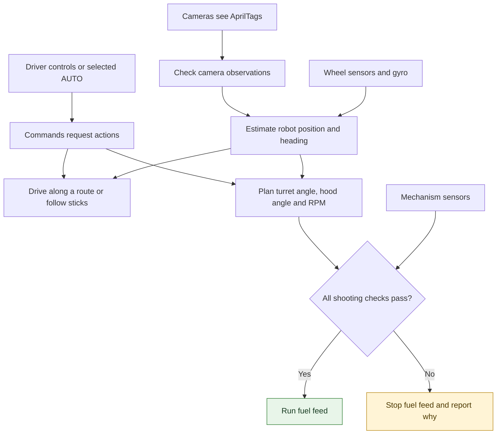

The **turret** points the shooter, the **hood** sets its launch angle, and the **flywheels** provide
launch speed. The **spindexer** supplies fuel to the **transfer**, which feeds the shooter. The intake
collects fuel. A single shooting supervisor coordinates these parts so one button does not create
several conflicting shooting decisions.

The turret must boot in its known physical stow position. Its pinion encoder alone cannot distinguish
every possible turret angle after a reboot; software needs that physical starting reference.

Commands describe actions that may last many robot loops. The scheduler decides which command owns
each mechanism. Sensors and readiness checks keep updating while a command runs.

## 2. What each robot mode permits


Editable Mermaid source

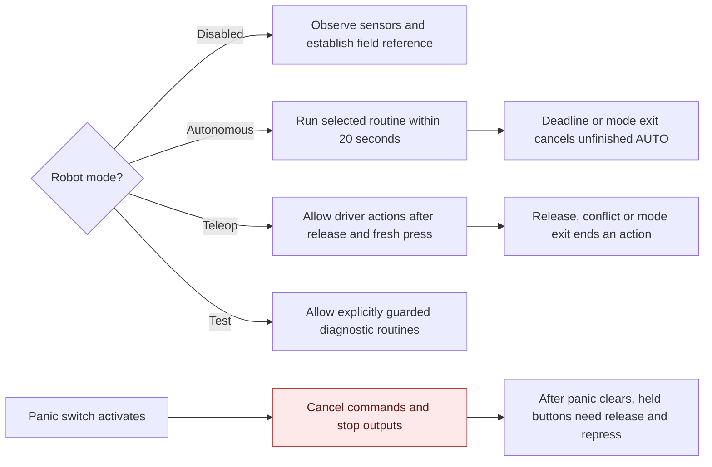

Driver action buttons cannot take over an autonomous command. Switching modes also cannot resurrect
an action merely because its button is still held. The panic switch is monitored even while disabled.
The driver-forward button changes how joystick directions feel; it does not change the robot's
estimated field position or heading.

## 3. How the robot learns where it is

**Connected camera does not mean ready localization.** The camera needs the right field layout and
measured mounting calibration, then the software needs usable observations.


Editable Mermaid source

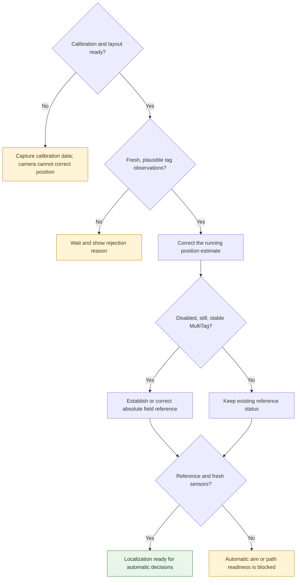

“MultiTag” means a camera solved position using at least two AprilTags. One healthy camera can
establish the reference; fresh cameras that disagree prevent automatic initialization. Once enabled,
the gyro owns heading and accepted vision corrects position. Old images captured before a pose reset
are discarded. There is no fixed two-second wait at the beginning of AUTO.

The shipped real-camera mounting coordinates are deliberately unmeasured. Complete the
[camera installation](installation.md) and [calibration procedure](calibration.md) before expecting
automatic localization. A tight cluster of camera readings demonstrates repeatability, not correct
physical coordinates.

## 4. Why pressing shoot may not feed fuel

This is a simplified decision tree. The [programming guide](programming-diagrams.md#7-feed-permission-in-exact-priority-order)
lists the exact order of every diagnostic reason.


Editable Mermaid source

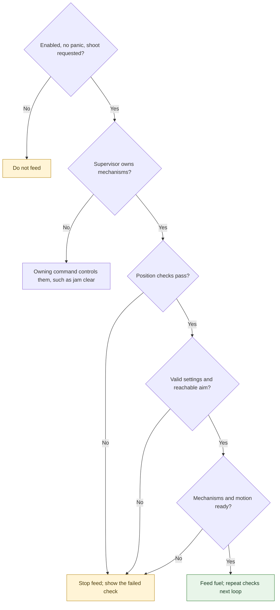

Position checks include localization, field zone, trench lock and any AUTO path failure. Mechanism
checks include turret trust/aim, RPM, hood, permitted chassis motion and the short fuel-release cooldown.
The checks continue **while firing**. Losing RPM, aim, position permission or another readiness
condition stops fuel feed. A timer cannot force an unready shot. Releasing shoot stops feeding;
the shooter can still use its intentional 2,200 RPM idle spin while enabled and otherwise permitted.

For automatic hub shots, the code requires confirmed position inside our alliance zone now and at
estimated fuel release. The mentor retained **manual fallback with driver-confirmed position** when
localization is unavailable. This applies to a non-moving shot mode with hub tracking disabled;
`AutoShoot/ManualZoneConfirmationRequired` indicates it. Software cannot confirm the driver's location
in that case. Mechanism readiness and any known trench lock still apply.

Approaching a known trench locks shooting and requests a lowered hood. Leaving the trench does not
automatically resume an old held request: release and request shooting again outside the guard.
The guard's margins and timing still need physical validation. Passing is selected in the appropriate
field region, but feed remains inhibited until the separate passing table has measured data.

## 5. What happens when an action is cut short


Editable Mermaid source

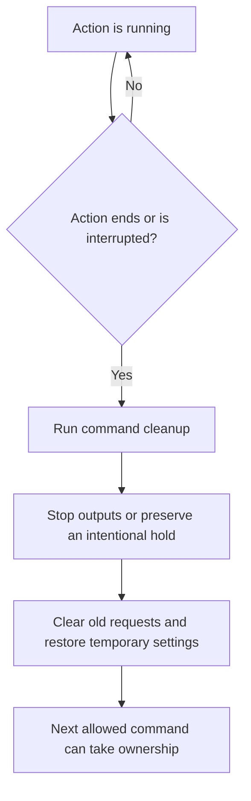

Release, timeout, mode exit or a conflicting action can end a running command. For example, jam clear
takes the shooter, transfer and spindexer together, cancels the old shooting
request, and stops all three when it ends. It never resumes the old volley. Intake commands restore
temporary power settings even when interrupted. Timing out while homing the intake does not count
as evidence that it reached its physical zero.

## 6. How autonomous paths finish


Editable Mermaid source

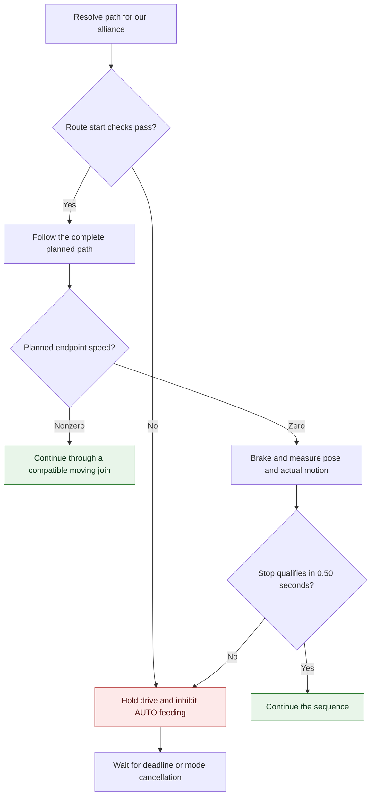

Route start checks require ready localization, valid route geometry and suitable starting position.
Ordinary competition stops **brake and check**; they do not chase small vision changes with corrective
motion. Explicit precision tests still use a tighter alignment controller that may move while settling.
Timeout is a failed stop, so the autonomous sequence cannot treat it as arrival. The opening move is
a constrained approach to the path's starting corridor, not general obstacle avoidance.

The current full Main/Worlds routines are still too long. Main's named paths alone take a nominal
**20.829 seconds**, before the opening approach, deployment, stop checks and final shot. A 20-second
deadline interrupts unfinished work; it does not make the whole plan fit. The pending choice is to
keep the first collection and shoot for the remaining time, or permit a later pickup only with enough
time reserved for return and shooting. **Neither revised strategy is implemented yet.** The chooser
default remains **Do nothing**. See the [timing audit](second-pass-audit.md#auto-stop-and-trajectory-findings).

## 7. What simulation and testing tell us


Editable Mermaid source

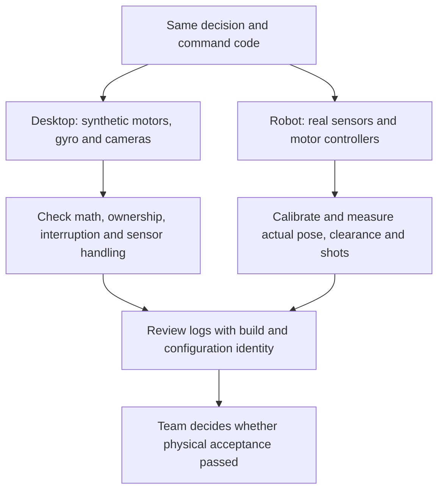

Simulation models supply synthetic sensor readings and battery load only on the desktop. Resetting
the estimated pose does not teleport the simulated robot. The models do not establish real stopping
accuracy, trench clearance or shot percentage; they do not model validated fuel transport or flight.
Climb remains disabled pending physical home, limits and follower-direction checks.

## Where to look when the robot waits

| What the team sees | First useful indication | Meaning |
|---|---|---|
| Camera connected, automatic actions unavailable | `Vision/InitializationState`, `Vision/LocalizationReady` | Connection, valid images and trusted field reference are different steps. |
| Shoot held, no feed | `AutoShoot/FeedReason` | The first failing readiness check explains the block. |
| Manual shot without localization | `AutoShoot/ManualZoneConfirmationRequired` | Driver must confirm field position. |
| Shooting does not restart after a trench | `AutoShoot/TrenchLocked` in logs | A fresh request is required outside the guard. |
| AUTO stops progressing | `Auto/RouteStop/Result`, `DriveToPose/Failure` in logs | A required stop or route prerequisite failed. |
| Mechanism position is untrusted | Relevant trust/configuration outputs in the [code guide](code-guide.md#logs-and-verification) | Recheck the physical reference and reset/configuration history. |

Continue with the [acceptance checklist](testing.md) for robot testing or the
[programming diagrams](programming-diagrams.md) for exact decisions and source links.
